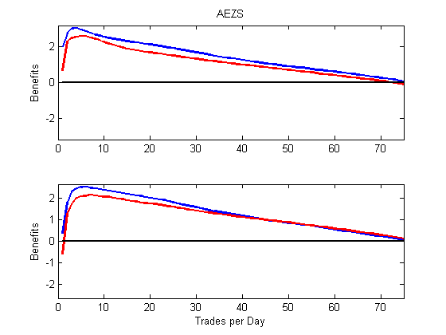

[](http://quantlet.de/index.php?p=info)

## [](http://quantlet.de/) **VFARbenefitPlot** [](http://quantlet.de/d3/ia)

```yaml

Name of Quantlet : VFARbenefitPlot

Published in : Unpublished; VFAR

Description : 'Plot benefit of strategic placement of orders according to VFAR predictions 
over equal-splitting strategy'

Keywords : 'LOB, VFAR, order execution'

See also : 'VFARmapePlot, VFARrandVfarPlot, VFARrandhStepForecastPlot, VFARqqPlot'

Author : Ying Chen, Wee Song Chua, Wolfgang Karl Haerdle

Submitted : Sat, Mar 11 2017 by Wee Song Chua

Datafile : AEZSbenefit.mat

Example: 
- Plot : "Benefit of VFAR-implied strategy over equal-splitting strategy"

```


